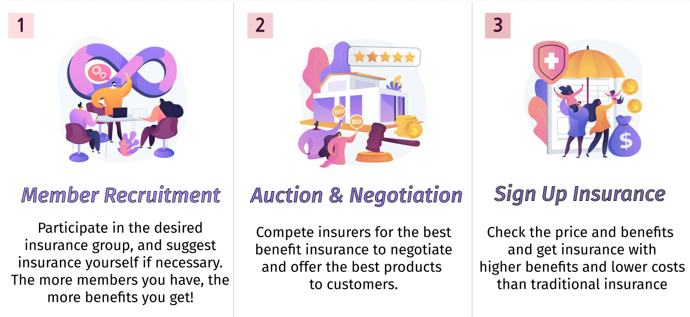
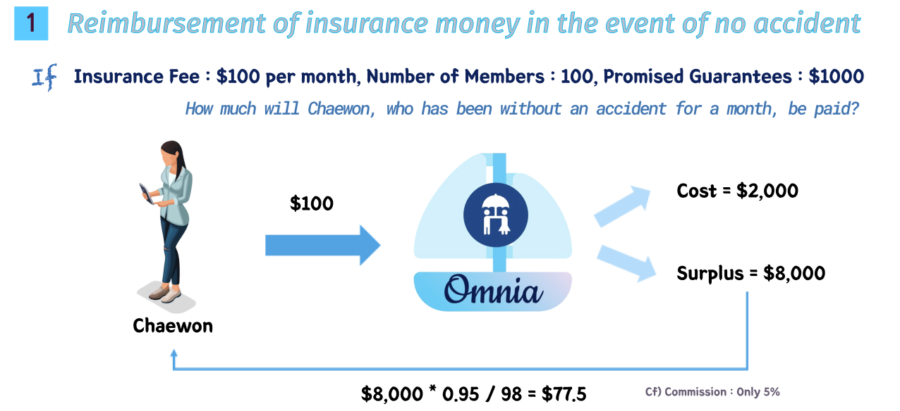
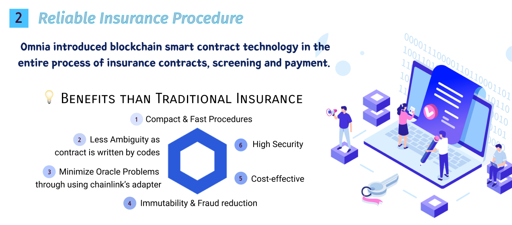
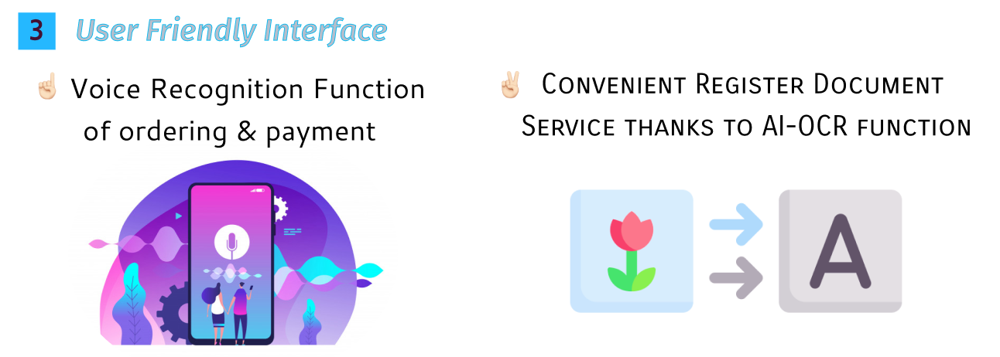

# Chainlink Virtual Hackathon Spring 2021
## Omnia: Blockchain-based P2P Insurance Platform

 
<h3>1.  Member </h3>

| Name   	| Role                         	|
|--------	|-------------------------------	|
| Kim HeeYun  	| Back-end Developer |
| Lee YongWook 	| Front-end Developer |
| Lee JeongMin 	| SmartContract Developer	|
| Jeong Chaewon 	| Project Manager  |

<h3>2.  Introduction </h3>
“Uni navi ne committas omnia” is a Latin saying, ‘Don’t leave everything in one boat.’  
As such, we decided to make catchphrase in hopes of safely distributing risks through our platform.  
Namely, We created a platform called ‘Omnia’ to give people a well-being life by creating an insurance platform that can safely distribute risks with a blockchain.

<h3>3.  Service Features </h3>

We serve as a platform for connecting small needs that individuals have. It recruits members from inside the platform, competes with insurance companies for insurance with the best benefits, and conducts negotiations to open insurance. Inform members of the results of the negotiations and guide members to sign up. At this time, the entire process from subscription to payment of screening was designed to introduce smart contract technology.  
<h4> Service Process </h4>

 
<h4> Omnia's Advantages </h4>

It was difficult to receive insurance money because of an accident in the existing p2p insurance. Of course, there are cases in some insurance that reduce up to 90 percent, but it is rare. The reason may be that there are risks in terms of profitability. Omnia intends to use blockchain technology not only for the process of insurance procedures, but also for the formation of profitable models. Using DEFI technology, it is intended to be returned to the user by dividing the amount collected from the entire population, excluding the premium deducted. At this time, the fee for the platform was set very low at 5%. Still, the company can take a stable profit model. This is because there is revenue operated by fees and DEFI. Currently, we envision a model for making DAI of MakerDAo and Staking of Compound. A more specific liquidity management protocol will be disclosed at the final submission. 
 

 

 

<h3> 4. Service Architecture </h3>

<h3> 5. Develop Process </h3>

Using React, express(nodejs framework) and truffle, we will make web server for communicating with client. React for client screen, express for backend server and truffle for smartcontract deploy. Also we will make smartcontract for the insurance on the insurance page. This operates insurance payment when accidents when an accident occurred and it was certified. It is also operated when an accident does not occur and is overdue. The chainlink node will be built for importing the insurer's external data into the blockchain network. 

<h3> Contract </h3>

Through the chainlink external adapter, we will get approved insurance data from oracle Node. When chainlink client request an information, oracle contract request to oracle node and oracle node give requested information using json as you can see above. Using that json, smartcontract will be operated and it will give insurance payment if it corresponds to a written code.
