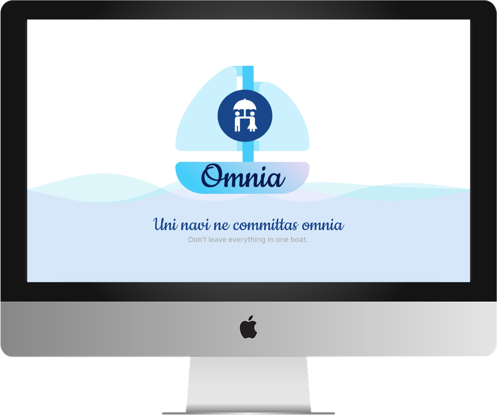
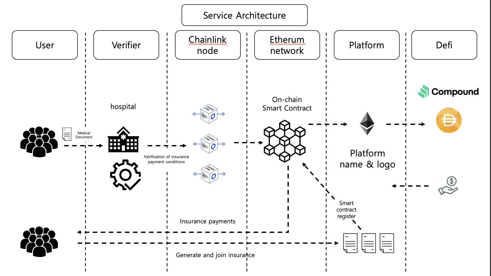
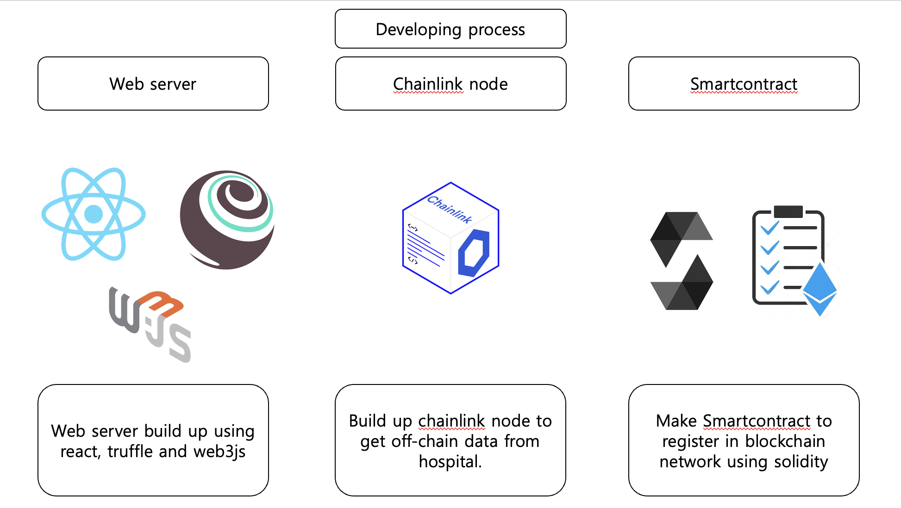
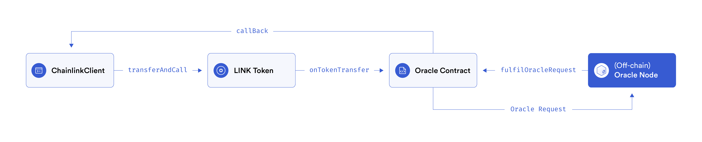

# Chainlink Virtual Hackathon Spring 2021
## Omnia: Blockchain-based P2P Insurance Platform

<h3>1.  Member </h3>

| Name   	| Role                         	|
|--------	|-------------------------------	|
| Kim HeeYun  	| Back-end Developer |
| Lee YongWook 	| Front-end Developer |
| Lee JeongMin 	| SmartContract Developer	|
| Jeong Chaewon 	| Project Manager  |

<h3>2.  Introduction </h3>
“Uni navi ne committas omnia” is a Latin saying, ‘Don’t leave everything in one boat.’ 
As such, we decided to make catchphrase in hopes of safely distributing risks through our platform. 
Namely, We created a platform called ‘Omnia’ to give people a well-being life by creating an insurance platform that can safely distribute risks with a blockchain.

<h3>3.  Service Features </h3>

<h3> 4. Service Architecture </h3>

<h3> 5. Develop Process </h3>

Using React, express(nodejs framework) and truffle, we will make web server for communicating with client. React for client screen, express for backend server and truffle for smartcontract deploy. Also we will make smartcontract for the insurance on the insurance page. This operates insurance payment when accidents when an accident occurred and it was certified. It is also operated when an accident does not occur and is overdue. The chainlink node will be built for importing the insurer's external data into the blockchain network. 

<h3> Contract </h3>

Through the chainlink external adapter, we will get approved insurance data from oracle Node. When chainlink client request an information, oracle contract request to oracle node and oracle node give requested information using json as you can see above. Using that json, smartcontract will be operated and it will give insurance payment if it corresponds to a written code.
