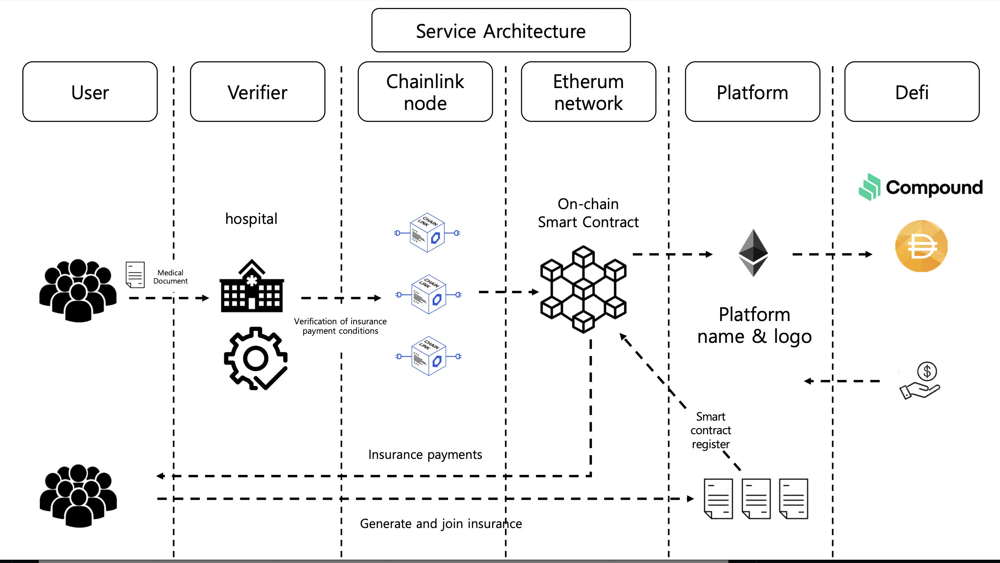
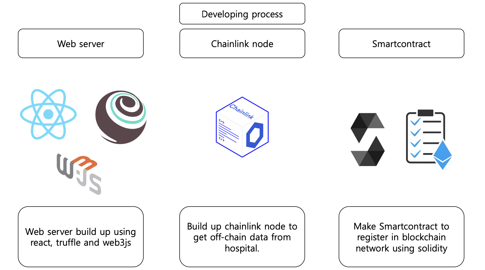

# Chainlink Virtual Hackathon Spring 2021
## Omnia: Blockchain-based P2P Insurance Platform

 
<h3>1.  Member </h3>

| Name   	| Role                         	|
|--------	|-------------------------------	|
| Kim HeeYoun  	| Back-end Developer |
| Lee YongWook 	| Front-end Developer |
| Lee JeongMin 	| SmartContract Developer	|
| Jeong Chaewon 	| Project Manager & AI Developer  |

<h3>2.  Inspiration  </h3>

### Omnia is a ***blockchain-based p2p(peer-to-peer) insurance platform***. 

Personally, we were dissatisfied with the chronic problems of the existing insurance industry.  
For example, because of the issue of revenue structures, there were complaints about the inability of insurance to be generated for small needs, large amounts to be paid to cover risks, and complex contract procedures.  
We had only vaguely thought of solving the problem, but through this opportunity, we were able to solve the problems one by one by designing and developing a p2p service that specifically introduced blockchain.

#### Omnia's Vision
“Uni navi ne committas omnia” is a Latin saying, ‘Don’t leave everything in one boat.’
As such, we decided to make catchphrase in hopes of safely distributing risks through our platform.
Namely, We created a platform called ‘Omnia’ to give people a well-being life by creating an insurance platform that can safely distribute risks with a blockchain.

<h3>3.  Service Features </h3>

We serve as a platform for connecting small needs that individuals have. It recruits members from inside the platform, competes with insurance companies for insurance with the best benefits, and conducts negotiations to open insurance. Inform members of the results of the negotiations and guide members to sign up. At this time, the entire process from subscription to payment of screening was designed to introduce smart contract technology.  
<h4> Service Process </h4>

 
<h4> Omnia's Advantages </h4>

It was difficult to receive insurance money because of an accident in the existing p2p insurance. Of course, there are cases in some insurance that reduce up to 90 percent, but it is rare. The reason may be that there are risks in terms of profitability. Omnia intends to use blockchain technology not only for the process of insurance procedures, but also for the formation of profitable models. Using DEFI, it is intended to be returned to the user by dividing the amount collected from the entire population, excluding the premium deducted. At this time, the fee for the platform was set very low at 5%. Still, the company can take a stable profit model. This is because there is revenue operated by fees and DEFI. Currently, we envision a model for making DAI of MakerDAo and Staking of Compound. A more specific liquidity management protocol will be disclosed at the final submission.  
 

 In the current insurance industry, the use of blockchain is being partially utilized. Omnia intends to provide efficient infrastructure by introducing smart contract technology throughout the entire process, including subscription, screening, and insurance payments. Omnia has more advantages than the traditional insurance industry.
 First of all, it has simple and fast procedures, so you can experience high UX in terms of consumers, and it is also economical for the company. If operating costs decrease, it will also be replaceable with a large amount that can be returned to consumers. In addition, contracts are all written in code, thus reducing the ambiguity of contracts. Blockchain technology will provide high security, reduced fraud, and immutability.
Finally, we also try to minimize the chronic 'oracle problem' experienced by existing blockchain industries using chainlink's adapter. 
 

 
We also considered ways to improve UX from the perspective of consumers. So what we've come up with is two functions. It will gradually introduce functions such as ordering and consulting by voice by linking voice recognition api inside the web. It is expected that this will improve the quality of experience for the underprivileged who are struggling with the IT UI.
In addition, in addition to the automatic upload function that Verifier automatically sends documents, we will also introduce the function to manually upload insurance review documents by linking OCR API.

<h3> 4. Service Architecture </h3>

Approximately, we designed the architecture as follows: Since it is a development demonstration, Verifier is difficult to recruit in reality, so it will be recruited and shown in future projects. Development is being carried out based on that architecture, and more detailed development and architecture will be uploaded at the final announcement.
 

<h3> 5. Develop Process </h3>

Using React, express(nodejs framework) and truffle, we will make web server for communicating with client. React for client screen, express for backend server and truffle for smartcontract deploy. Also we will make smartcontract for the insurance on the insurance page. This operates insurance payment when accidents when an accident occurred and it was certified. It is also operated when an accident does not occur and is overdue. The chainlink node will be built for importing the insurer's external data into the blockchain network. 

<h3> Contract </h3>

Through the chainlink external adapter, we will get approved insurance data from oracle Node. When chainlink client request an information, oracle contract request to oracle node and oracle node give requested information using json as you can see above. Using that json, smartcontract will be operated and it will give insurance payment if it corresponds to a written code.

<h3>6.  Benefits </h3>

